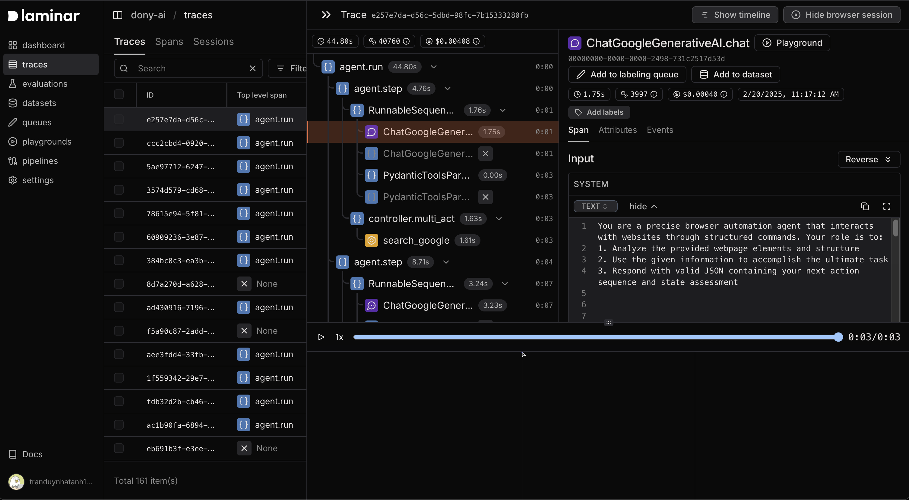
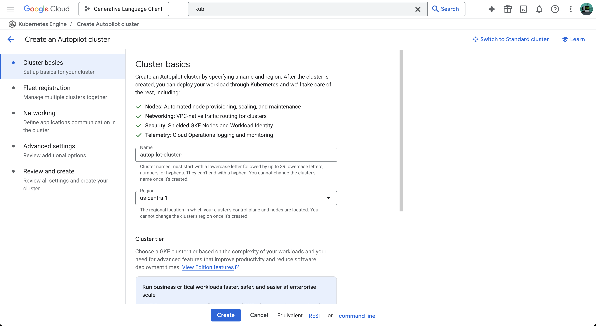
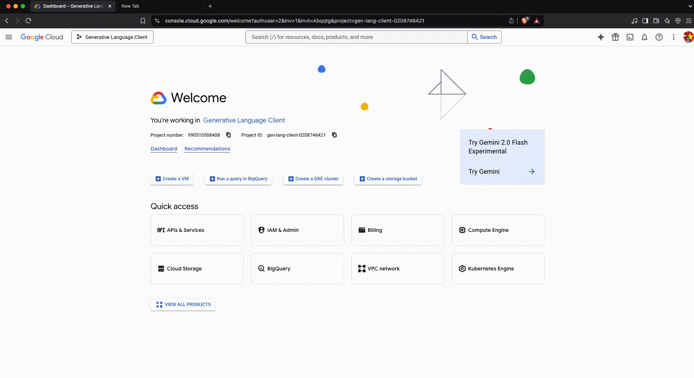
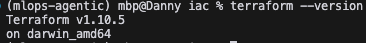

# Real-time-Agentic-MLops

A MLops pipeline for real-time agentic system.

[](./assets/images/Architecture-realtime.png)

## Introduction

TBD

## Table of Contents

- [1. Introduction](#introduction)
- [2. Key Features](#key-features)
- [3. Project Structures](#project-structures)
- [4. Overall Architecture](#architecture)
- [5. Getting Started](#getting-started)
    - [5.1. Development stage](#development-stage)
        - [5.1.1. Set up environments](#set-up-environments)
            - [5.1.2. Install uv](#install-uv)
            - [5.1.3. Install libraries and dependencies](#install-libraries)
            - [5.1.4. Install docker](#install-docker)
        - [5.1.5. Inference FastAPI app](#inference-fastapi-app)
            - [5.1.6. Inference in localhost](#inference-in-localhost)
            - [5.1.7. Inference in Docker container](#inference-in-docker-container)
        - [5.1.8. Log and trace with laminar](#set-up-laminar-development)
    - [5.2. Production stage](#production-stage)
        - [5.2.1. Set up](#9-set-up)
            - [5.2.2. Set up Google Cloud Platform (GCP)](#91-set-up-gcp)
                - [5.2.2.1. Create a project in Google Cloud Platform (GCP)](#911-create-a-project-in-gcp)
                - [5.2.2.2. Enabling the Kubernetes Engine API](#912-enabling-the-kubernetes-engine-api)
                - [5.2.2.3. Install and setup Google Cloud CLI](#913-install-and-setup-google-cloud-cli)
                - [5.2.2.4. Install gke-cloud-auth-plugin](#914-install-gke-cloud-auth-plugin)
                - [5.2.2.5. Create a service account](#915-create-a-service-account)
            - [5.2.3. Install Terraform](#92-install-terraform)
            - [5.2.4. Install kubectl, kubectx and kubens](#93-install-kubectl-kubectx-and-kubens)
            - [5.2.5. Install helm](#94-install-helm)
        - [5.2.6. Using Terraform for Google Kubernetes Engine (GKE)](#using-terraform-for-google-kubernetes-engine-gke)
            - [5.2.6.1. Set up the cluster](#set-up-the-cluster)
            - [5.2.6.2. Retrive the cluster information](#retrive-cluster-information)
        - [5.2.7. Deployment to Google Kubernetes Engine (GKE)](#deployment-to-gke)
            - [5.2.7.1. Configure API Key Secret](#configure-api-key-secret)
            - [5.2.7.2. Deploy Nginx-Ingress controller](#deploy-nginx-ingress-controller)
            - [5.2.7.3. Deploy FastAPI controller](#deploy-fastapi-controller)
            - [5.2.7.4. Deploy Monitoring controller](#deploy-monitoring-controller)

        - [5.2.8. Continuous Integration/Continuous Deployment (CI/CD) with Ansible and Jenkins](#continuous-integrationcontinuous-deployment-cicd-with-travis-ci)
            - [5.2.8.1. Set up Jenkins Server](#set-up-travis-ci-server)
            - [5.2.8.2. Access Jenkins](#access-travis-ci)
            - [5.2.8.3. Install Jenkins Plugins](#install-travis-ci-plugins)
            - [5.2.8.4. Configure Jenkins](#configure-travis-ci)
            - [5.2.8.5. Test the setup](#test-the-travis-ci-setup)
        - [5.2.9. Log and trace with Laminar](#set-up-laminar-production)
        - [5.2.10. Monitoring with Prometheus and Gafana](#monitoring-with-prometheus-and-gafana)
            - [5.2.10.1. Quick start](#quick-start)
            - [5.2.10.2. Test the setup](#test-the-monitoring-setup)


- [6. Contributing](#contributing)
- [7. License](#license)
- [8. Citations](#citations)
- [9. Contact](#contact)

## Project Structures
Using project structures of [LLM-Kit](https://engineering.grab.com/supercharging-llm-application-development-with-llm-kit)
```
.
├── Jenkinsfile
├── LLM_serving.ipynb
├── README.md
├── assets
│   ├── images
│   │   ├── Architecture-realtime.png
│   │   ├── Architecture.png
│   │   └── terraform_version.png
│   └── videos
│       └── create_iam.gif
├── deployments
│   ├── app
│   │   ├── Chart.yaml
│   │   ├── templates
│   │   │   ├── app_ingress.yaml
│   │   │   ├── deployment.yaml
│   │   │   └── service.yaml
│   │   └── values.yaml
│   ├── lmnr
│   ├── nginx_ingress
│   │   ├── Chart.yaml
│   │   ├── README.md
│   │   ├── crds
│   │   │   ├── appprotect.f5.com_aplogconfs.yaml
│   │   │   ├── appprotect.f5.com_appolicies.yaml
│   │   │   ├── appprotect.f5.com_apusersigs.yaml
│   │   │   ├── appprotectdos.f5.com_apdoslogconfs.yaml
│   │   │   ├── appprotectdos.f5.com_apdospolicy.yaml
│   │   │   ├── appprotectdos.f5.com_dosprotectedresources.yaml
│   │   │   ├── externaldns.nginx.org_dnsendpoints.yaml
│   │   │   ├── k8s.nginx.org_globalconfigurations.yaml
│   │   │   ├── k8s.nginx.org_policies.yaml
│   │   │   ├── k8s.nginx.org_transportservers.yaml
│   │   │   ├── k8s.nginx.org_virtualserverroutes.yaml
│   │   │   └── k8s.nginx.org_virtualservers.yaml
│   │   ├── templates
│   │   │   ├── NOTES.txt
│   │   │   ├── _helpers.tpl
│   │   │   ├── controller-configmap.yaml
│   │   │   ├── controller-daemonset.yaml
│   │   │   ├── controller-deployment.yaml
│   │   │   ├── controller-globalconfiguration.yaml
│   │   │   ├── controller-hpa.yaml
│   │   │   ├── controller-ingress-class.yaml
│   │   │   ├── controller-leader-election-configmap.yaml
│   │   │   ├── controller-pdb.yaml
│   │   │   ├── controller-secret.yaml
│   │   │   ├── controller-service.yaml
│   │   │   ├── controller-serviceaccount.yaml
│   │   │   ├── controller-servicemonitor.yaml
│   │   │   ├── controller-wildcard-secret.yaml
│   │   │   └── rbac.yaml
│   │   ├── values-icp.yaml
│   │   ├── values-nsm.yaml
│   │   ├── values-plus.yaml
│   │   ├── values.schema.json
│   │   └── values.yaml
│   └── prometheus
│       └── kube-prometheus-stack
│           ├── CONTRIBUTING.md
│           ├── Chart.lock
│           ├── Chart.yaml
│           ├── README.md
│           ├── charts
│           │   ├── crds
│           │   │   ├── Chart.yaml
│           │   │   ├── README.md
│           │   │   └── crds
│           │   │       ├── crd-alertmanagerconfigs.yaml
│           │   │       ├── crd-alertmanagers.yaml
│           │   │       ├── crd-podmonitors.yaml
│           │   │       ├── crd-probes.yaml
│           │   │       ├── crd-prometheusagents.yaml
│           │   │       ├── crd-prometheuses.yaml
│           │   │       ├── crd-prometheusrules.yaml
│           │   │       ├── crd-scrapeconfigs.yaml
│           │   │       ├── crd-servicemonitors.yaml
│           │   │       └── crd-thanosrulers.yaml
│           │   ├── grafana
│           │   │   ├── Chart.yaml
│           │   │   ├── README.md
│           │   │   ├── ci
│           │   │   │   ├── default-values.yaml
│           │   │   │   ├── with-affinity-values.yaml
│           │   │   │   ├── with-dashboard-json-values.yaml
│           │   │   │   ├── with-dashboard-values.yaml
│           │   │   │   ├── with-extraconfigmapmounts-values.yaml
│           │   │   │   ├── with-image-renderer-values.yaml
│           │   │   │   └── with-persistence.yaml
│           │   │   ├── dashboards
│           │   │   │   └── custom-dashboard.json
│           │   │   ├── templates
│           │   │   │   ├── NOTES.txt
│           │   │   │   ├── _config.tpl
│           │   │   │   ├── _helpers.tpl
│           │   │   │   ├── _pod.tpl
│           │   │   │   ├── clusterrole.yaml
│           │   │   │   ├── clusterrolebinding.yaml
│           │   │   │   ├── configSecret.yaml
│           │   │   │   ├── configmap-dashboard-provider.yaml
│           │   │   │   ├── configmap.yaml
│           │   │   │   ├── dashboards-json-configmap.yaml
│           │   │   │   ├── deployment.yaml
│           │   │   │   ├── extra-manifests.yaml
│           │   │   │   ├── headless-service.yaml
│           │   │   │   ├── hpa.yaml
│           │   │   │   ├── image-renderer-deployment.yaml
│           │   │   │   ├── image-renderer-hpa.yaml
│           │   │   │   ├── image-renderer-network-policy.yaml
│           │   │   │   ├── image-renderer-service.yaml
│           │   │   │   ├── image-renderer-servicemonitor.yaml
│           │   │   │   ├── ingress.yaml
│           │   │   │   ├── networkpolicy.yaml
│           │   │   │   ├── poddisruptionbudget.yaml
│           │   │   │   ├── podsecuritypolicy.yaml
│           │   │   │   ├── pvc.yaml
│           │   │   │   ├── role.yaml
│           │   │   │   ├── rolebinding.yaml
│           │   │   │   ├── secret-env.yaml
│           │   │   │   ├── secret.yaml
│           │   │   │   ├── service.yaml
│           │   │   │   ├── serviceaccount.yaml
│           │   │   │   ├── servicemonitor.yaml
│           │   │   │   ├── statefulset.yaml
│           │   │   │   └── tests
│           │   │   │       ├── test-configmap.yaml
│           │   │   │       ├── test-podsecuritypolicy.yaml
│           │   │   │       ├── test-role.yaml
│           │   │   │       ├── test-rolebinding.yaml
│           │   │   │       ├── test-serviceaccount.yaml
│           │   │   │       └── test.yaml
│           │   │   └── values.yaml
│           │   ├── kube-state-metrics
│           │   │   ├── Chart.yaml
│           │   │   ├── README.md
│           │   │   ├── templates
│           │   │   │   ├── NOTES.txt
│           │   │   │   ├── _helpers.tpl
│           │   │   │   ├── ciliumnetworkpolicy.yaml
│           │   │   │   ├── clusterrolebinding.yaml
│           │   │   │   ├── crs-configmap.yaml
│           │   │   │   ├── deployment.yaml
│           │   │   │   ├── extra-manifests.yaml
│           │   │   │   ├── kubeconfig-secret.yaml
│           │   │   │   ├── networkpolicy.yaml
│           │   │   │   ├── pdb.yaml
│           │   │   │   ├── podsecuritypolicy.yaml
│           │   │   │   ├── psp-clusterrole.yaml
│           │   │   │   ├── psp-clusterrolebinding.yaml
│           │   │   │   ├── rbac-configmap.yaml
│           │   │   │   ├── role.yaml
│           │   │   │   ├── rolebinding.yaml
│           │   │   │   ├── service.yaml
│           │   │   │   ├── serviceaccount.yaml
│           │   │   │   ├── servicemonitor.yaml
│           │   │   │   ├── stsdiscovery-role.yaml
│           │   │   │   ├── stsdiscovery-rolebinding.yaml
│           │   │   │   └── verticalpodautoscaler.yaml
│           │   │   └── values.yaml
│           │   ├── prometheus-node-exporter
│           │   │   ├── Chart.yaml
│           │   │   ├── README.md
│           │   │   ├── ci
│           │   │   │   └── port-values.yaml
│           │   │   ├── templates
│           │   │   │   ├── NOTES.txt
│           │   │   │   ├── _helpers.tpl
│           │   │   │   ├── clusterrole.yaml
│           │   │   │   ├── clusterrolebinding.yaml
│           │   │   │   ├── daemonset.yaml
│           │   │   │   ├── endpoints.yaml
│           │   │   │   ├── extra-manifests.yaml
│           │   │   │   ├── networkpolicy.yaml
│           │   │   │   ├── podmonitor.yaml
│           │   │   │   ├── psp-clusterrole.yaml
│           │   │   │   ├── psp-clusterrolebinding.yaml
│           │   │   │   ├── psp.yaml
│           │   │   │   ├── rbac-configmap.yaml
│           │   │   │   ├── service.yaml
│           │   │   │   ├── serviceaccount.yaml
│           │   │   │   ├── servicemonitor.yaml
│           │   │   │   └── verticalpodautoscaler.yaml
│           │   │   └── values.yaml
│           │   └── prometheus-windows-exporter
│           │       ├── Chart.yaml
│           │       ├── README.md
│           │       ├── templates
│           │       │   ├── _helpers.tpl
│           │       │   ├── config.yaml
│           │       │   ├── daemonset.yaml
│           │       │   ├── podmonitor.yaml
│           │       │   ├── service.yaml
│           │       │   ├── serviceaccount.yaml
│           │       │   └── servicemonitor.yaml
│           │       └── values.yaml
│           ├── templates
│           │   ├── NOTES.txt
│           │   ├── _helpers.tpl
│           │   ├── alertmanager
│           │   │   ├── alertmanager.yaml
│           │   │   ├── extrasecret.yaml
│           │   │   ├── ingress.yaml
│           │   │   ├── ingressperreplica.yaml
│           │   │   ├── podDisruptionBudget.yaml
│           │   │   ├── psp-role.yaml
│           │   │   ├── psp-rolebinding.yaml
│           │   │   ├── psp.yaml
│           │   │   ├── secret.yaml
│           │   │   ├── service.yaml
│           │   │   ├── serviceaccount.yaml
│           │   │   ├── servicemonitor.yaml
│           │   │   └── serviceperreplica.yaml
│           │   ├── exporters
│           │   │   ├── core-dns
│           │   │   │   ├── service.yaml
│           │   │   │   └── servicemonitor.yaml
│           │   │   ├── kube-api-server
│           │   │   │   └── servicemonitor.yaml
│           │   │   ├── kube-controller-manager
│           │   │   │   ├── endpoints.yaml
│           │   │   │   ├── service.yaml
│           │   │   │   └── servicemonitor.yaml
│           │   │   ├── kube-dns
│           │   │   │   ├── service.yaml
│           │   │   │   └── servicemonitor.yaml
│           │   │   ├── kube-etcd
│           │   │   │   ├── endpoints.yaml
│           │   │   │   ├── service.yaml
│           │   │   │   └── servicemonitor.yaml
│           │   │   ├── kube-proxy
│           │   │   │   ├── endpoints.yaml
│           │   │   │   ├── service.yaml
│           │   │   │   └── servicemonitor.yaml
│           │   │   ├── kube-scheduler
│           │   │   │   ├── endpoints.yaml
│           │   │   │   ├── service.yaml
│           │   │   │   └── servicemonitor.yaml
│           │   │   └── kubelet
│           │   │       └── servicemonitor.yaml
│           │   ├── extra-objects.yaml
│           │   ├── grafana
│           │   │   ├── configmap-dashboards.yaml
│           │   │   ├── configmaps-datasources.yaml
│           │   │   └── dashboards-1.14
│           │   │       ├── alertmanager-overview.yaml
│           │   │       ├── apiserver.yaml
│           │   │       ├── cluster-total.yaml
│           │   │       ├── controller-manager.yaml
│           │   │       ├── etcd.yaml
│           │   │       ├── grafana-overview.yaml
│           │   │       ├── k8s-coredns.yaml
│           │   │       ├── k8s-resources-cluster.yaml
│           │   │       ├── k8s-resources-multicluster.yaml
│           │   │       ├── k8s-resources-namespace.yaml
│           │   │       ├── k8s-resources-node.yaml
│           │   │       ├── k8s-resources-pod.yaml
│           │   │       ├── k8s-resources-windows-cluster.yaml
│           │   │       ├── k8s-resources-windows-namespace.yaml
│           │   │       ├── k8s-resources-windows-pod.yaml
│           │   │       ├── k8s-resources-workload.yaml
│           │   │       ├── k8s-resources-workloads-namespace.yaml
│           │   │       ├── k8s-windows-cluster-rsrc-use.yaml
│           │   │       ├── k8s-windows-node-rsrc-use.yaml
│           │   │       ├── kubelet.yaml
│           │   │       ├── namespace-by-pod.yaml
│           │   │       ├── namespace-by-workload.yaml
│           │   │       ├── node-cluster-rsrc-use.yaml
│           │   │       ├── node-rsrc-use.yaml
│           │   │       ├── nodes-darwin.yaml
│           │   │       ├── nodes.yaml
│           │   │       ├── persistentvolumesusage.yaml
│           │   │       ├── pod-total.yaml
│           │   │       ├── prometheus-remote-write.yaml
│           │   │       ├── prometheus.yaml
│           │   │       ├── proxy.yaml
│           │   │       ├── scheduler.yaml
│           │   │       └── workload-total.yaml
│           │   ├── prometheus
│           │   │   ├── _rules.tpl
│           │   │   ├── additionalAlertRelabelConfigs.yaml
│           │   │   ├── additionalAlertmanagerConfigs.yaml
│           │   │   ├── additionalPrometheusRules.yaml
│           │   │   ├── additionalScrapeConfigs.yaml
│           │   │   ├── ciliumnetworkpolicy.yaml
│           │   │   ├── clusterrole.yaml
│           │   │   ├── clusterrolebinding.yaml
│           │   │   ├── csi-secret.yaml
│           │   │   ├── extrasecret.yaml
│           │   │   ├── ingress.yaml
│           │   │   ├── ingressThanosSidecar.yaml
│           │   │   ├── ingressperreplica.yaml
│           │   │   ├── networkpolicy.yaml
│           │   │   ├── podDisruptionBudget.yaml
│           │   │   ├── podmonitors.yaml
│           │   │   ├── prometheus.yaml
│           │   │   ├── psp-clusterrole.yaml
│           │   │   ├── psp-clusterrolebinding.yaml
│           │   │   ├── psp.yaml
│           │   │   ├── rules-1.14
│           │   │   │   ├── alertmanager.rules.yaml
│           │   │   │   ├── config-reloaders.yaml
│           │   │   │   ├── etcd.yaml
│           │   │   │   ├── general.rules.yaml
│           │   │   │   ├── k8s.rules.container_cpu_usage_seconds_total.yaml
│           │   │   │   ├── k8s.rules.container_memory_cache.yaml
│           │   │   │   ├── k8s.rules.container_memory_rss.yaml
│           │   │   │   ├── k8s.rules.container_memory_swap.yaml
│           │   │   │   ├── k8s.rules.container_memory_working_set_bytes.yaml
│           │   │   │   ├── k8s.rules.container_resource.yaml
│           │   │   │   ├── k8s.rules.pod_owner.yaml
│           │   │   │   ├── kube-apiserver-availability.rules.yaml
│           │   │   │   ├── kube-apiserver-burnrate.rules.yaml
│           │   │   │   ├── kube-apiserver-histogram.rules.yaml
│           │   │   │   ├── kube-apiserver-slos.yaml
│           │   │   │   ├── kube-prometheus-general.rules.yaml
│           │   │   │   ├── kube-prometheus-node-recording.rules.yaml
│           │   │   │   ├── kube-scheduler.rules.yaml
│           │   │   │   ├── kube-state-metrics.yaml
│           │   │   │   ├── kubelet.rules.yaml
│           │   │   │   ├── kubernetes-apps.yaml
│           │   │   │   ├── kubernetes-resources.yaml
│           │   │   │   ├── kubernetes-storage.yaml
│           │   │   │   ├── kubernetes-system-apiserver.yaml
│           │   │   │   ├── kubernetes-system-controller-manager.yaml
│           │   │   │   ├── kubernetes-system-kube-proxy.yaml
│           │   │   │   ├── kubernetes-system-kubelet.yaml
│           │   │   │   ├── kubernetes-system-scheduler.yaml
│           │   │   │   ├── kubernetes-system.yaml
│           │   │   │   ├── node-exporter.rules.yaml
│           │   │   │   ├── node-exporter.yaml
│           │   │   │   ├── node-network.yaml
│           │   │   │   ├── node.rules.yaml
│           │   │   │   ├── prometheus-operator.yaml
│           │   │   │   ├── prometheus.yaml
│           │   │   │   ├── windows.node.rules.yaml
│           │   │   │   └── windows.pod.rules.yaml
│           │   │   ├── secret.yaml
│           │   │   ├── service.yaml
│           │   │   ├── serviceThanosSidecar.yaml
│           │   │   ├── serviceThanosSidecarExternal.yaml
│           │   │   ├── serviceaccount.yaml
│           │   │   ├── servicemonitor.yaml
│           │   │   ├── servicemonitorThanosSidecar.yaml
│           │   │   ├── servicemonitors.yaml
│           │   │   └── serviceperreplica.yaml
│           │   ├── prometheus-operator
│           │   │   ├── _prometheus-operator.tpl
│           │   │   ├── admission-webhooks
│           │   │   │   ├── _prometheus-operator-webhook.tpl
│           │   │   │   ├── deployment
│           │   │   │   │   ├── deployment.yaml
│           │   │   │   │   ├── pdb.yaml
│           │   │   │   │   ├── service.yaml
│           │   │   │   │   └── serviceaccount.yaml
│           │   │   │   ├── job-patch
│           │   │   │   │   ├── ciliumnetworkpolicy-createSecret.yaml
│           │   │   │   │   ├── ciliumnetworkpolicy-patchWebhook.yaml
│           │   │   │   │   ├── clusterrole.yaml
│           │   │   │   │   ├── clusterrolebinding.yaml
│           │   │   │   │   ├── job-createSecret.yaml
│           │   │   │   │   ├── job-patchWebhook.yaml
│           │   │   │   │   ├── networkpolicy-createSecret.yaml
│           │   │   │   │   ├── networkpolicy-patchWebhook.yaml
│           │   │   │   │   ├── psp.yaml
│           │   │   │   │   ├── role.yaml
│           │   │   │   │   ├── rolebinding.yaml
│           │   │   │   │   └── serviceaccount.yaml
│           │   │   │   ├── mutatingWebhookConfiguration.yaml
│           │   │   │   └── validatingWebhookConfiguration.yaml
│           │   │   ├── aggregate-clusterroles.yaml
│           │   │   ├── certmanager.yaml
│           │   │   ├── ciliumnetworkpolicy.yaml
│           │   │   ├── clusterrole.yaml
│           │   │   ├── clusterrolebinding.yaml
│           │   │   ├── deployment.yaml
│           │   │   ├── networkpolicy.yaml
│           │   │   ├── psp-clusterrole.yaml
│           │   │   ├── psp-clusterrolebinding.yaml
│           │   │   ├── psp.yaml
│           │   │   ├── service.yaml
│           │   │   ├── serviceaccount.yaml
│           │   │   ├── servicemonitor.yaml
│           │   │   └── verticalpodautoscaler.yaml
│           │   └── thanos-ruler
│           └── values.yaml
├── docker-compose.yml
├── iac
│   ├── ansible_setup
│   │   ├── deploy_app
│   │   │   ├── create_computer_instance.yaml
│   │   │   └── secrets
│   │   ├── deploy_jenkins
│   │   │   ├── create_compute_instance.yaml
│   │   │   ├── deploy_jenkins.yml
│   │   │   └── secrets
│   │   ├── inventory
│   │   ├── pyproject.toml
│   │   └── uv.lock
│   └── terraform
│       ├── main.tf
│       └── variables.tf
├── jenkins
│   ├── Dockerfile
│   └── docker-compose-jenkins.yaml
├── nginx
│   ├── Dockerfile
│   ├── certbot
│   ├── default.conf
│   ├── generate-ssl.sh
│   ├── nginx.conf
│   └── ssl
├── notebooks
├── pyproject.toml
├── secrets
├── setup.sh
├── src
│   ├── Dockerfile
│   ├── LICENSE
│   ├── Makefile
│   ├── __init__.py
│   ├── agent
│   │   ├── base_agent.py
│   │   ├── helper
│   │   │   ├── dummy_data.json
│   │   │   ├── google_search.py
│   │   │   ├── screenshot.py
│   │   │   └── vllm_serving.py
│   │   ├── operator_agent.py
│   │   ├── pydantic_ai_agent.py
│   │   └── vision_agent.py
│   ├── frontend
│   │   ├── images
│   │   │   └── logo.png
│   │   ├── index.html
│   │   ├── pcm-processor.js
│   ├── models
│   │   ├── action.py
│   │   ├── google_search.py
│   │   ├── history.py
│   │   ├── message.py
│   │   └── system_prompt.py
│   ├── pyproject.toml
│   ├── requirements.txt
│   ├── routes
│   │   ├── chat_socket.py
│   │   ├── health.py
│   │   ├── index.py
│   │   ├── vision_socket.py
│   │   └── voice_socket.py
│   ├── scripts
│   │   └── clone-supabase.sh
│   ├── server.py
│   ├── ssl
│   │   ├── tls.crt
│   │   └── tls.key
│   ├── tests
│   ├── tools
│   └── uv.lock
└── uv.lock
```

## Key features

- Sử dụng Websocket trong giao thức kết nối của chatbox, cải thiện độ trễ và tăng trải nghiệm người dùng.
- Rất dễ sử dụng với các khả năng scalability and flexibility, tùy chỉnh API giúp tiếp cận nhiều mô hình mới nhất. Khả năng triển khai nhanh chóng với một câu lệnh là có thể trải nghiệm được một hệ thống AI Agent hoàn chỉnh.
- Tối ưu chi phí vận hành xuống mức thấp nhất đối với một doanh nghiệp nhỏ (hoàn toàn có thể miễn phí nếu dưới 2500 requests/month).
- ...

## Getting Started

### Development Stage

#### Set up environments

> Before set up the enviroment, make sure your machine meets the following minimum system requirements:
>- CPU >= 2 Core
>- RAM >= 4 GiB
>- Storage >= 20GB

</br>

###### Install uv

This is easy to **install and use** UV package. You can install as instructions: [uv docs](https://github.com/astral-sh/uv)

```bash
uv --version
```
> **_IMPORTANT:_** If you want to check the uv package had installed, you should run the above scripts.

###### Install libraries and dependencies
With uv package, the source have **pyproject.toml** and you only run uv run fastapi dev to install and test AI services.
```bash
cd src
make dev
```

###### Install docker

Install docker as instructions: [Docker installation](https://docs.docker.com/engine/install/)

We also push images to Docker Hub. You need to log in to Docker by using the following command:
```bash
docker login
```
You will be prompted to enter your Docker Hub username, password, and email address (optional). After successful authentication, you can proceed with your Docker tasks, such as pushing or pulling images from Docker Hub.

###### Inference in localhost
```bash
make dev
```
###### Inference in Docker container
```bash
make prod
```
> **_IMPORTANT:_** Developer using MacOS with M1 chip and the dockerfile to differenece if you want to test in Linux server. You can create docker image for linux:
```bash
make docker-amd64
```
##### Log and trace with Laminar
Easily sign in or create a new account on the [Laminar Dashboard](https://www.lmnr.ai/sign-in?callbackUrl=/onboarding) to get started.
Once signed in, create a new project to monitor and analyze performance with Laminar.

This setup leverages **Laminar** combined with **OpenTelemetry** to track and analyze agent activity in web browsers, providing deep insights into user behavior and system performance.

### Production Stage

#### 9.1. Set up GCP

##### 9.1.1. Create a project in GCP

Refer to [Create a project in Google Cloud Platform (GCP)](#13-create-a-project-in-google-cloud-platform-gcp) in development stage.

##### 9.1.2. Enabling the Kubernetes Engine API

Navigate to the following link to enable Kubernetes Engine API: [Kubernetes Engine API](https://console.cloud.google.com/apis/library/container.googleapis.com)



##### 9.1.3. Install and setup Google Cloud CLI

Refer to [Install and setup Google Cloud CLI](#14-install-and-setup-google-cloud-cli) in development stage.

##### 9.1.4. Install gke-cloud-auth-plugin

Run the following command in your terminal:

```bash
sudo apt-get install google-cloud-cli-gke-gcloud-auth-plugin
```

##### 9.1.5. Create a service account

- Navigate to [Service acounts](https://console.cloud.google.com/iam-admin/serviceaccounts) and click "CREATE SERVICE ACCOUNT".
- Create new key as json type for your service account. Download this json file and save it in [sercets](sercets) directory. Update **credentials** in [terraform/main.tf](production/terraform/main.tf) with your json directory.
- Navigate to [IAM](https://console.cloud.google.com/iam-admin/iam) and click on "GRANT ACCESS". Then, add new principals; this principal should be your service account. Finally, select the `Owner` role.

Example how to create credentials:



#### 9.2. Install terraform

- Download terraform as instructions via this link: [Download terraform](https://developer.hashicorp.com/terraform/tutorials/aws-get-started/install-cli)
- Get terraform version and update **required_version** in [terraform/main.tf](production/terraform/main.tf)

    

#### 9.3. Install kubectl, kubectx and kubens

Kubectl, kubectx, and kubens are tools that can help with navigating clusters and namespaces in Kubernetes. Kubectl is a command-line tool that can be used to deploy applications, inspect resources, and view logs. Kubectx and kubens can help with faster context switching, which can reduce the need for manual command modifications.

- Install kubectl: [kubectl](https://kubernetes.io/docs/tasks/tools/install-kubectl-linux/)
- Install kubectx and kubens: [kubectx and kubens](https://github.com/ahmetb/kubectx#manual-installation-macos-and-linux)

#### 9.4. Install helm

Helm helps you manage Kubernetes applications — Helm Charts help you define, install, and upgrade even the most complex Kubernetes application.

- Install helm: [helm](https://helm.sh/docs/intro/install/)

#### 9.5. Connect to a Google Kubernetes Engine (GKE) cluster

##### 9.5.1. Create the GKE cluster

Update your **project_id** in [terraform/variables.tf](production/terraform/variables.tf) and then, run the following command:

```bash
cd terraform
terraform init
terraform plan
terraform apply
```

The GKE cluster I configured has 1 node and its machine is "e2-standard-2" (2 CPU and 8 GB Memory)


##### 9.5.2. Connect to the GKE cluster

- Navigate to [GKE UI](https://console.cloud.google.com/kubernetes/list)
- Click on the vertical ellipsis icon and choose "Connect". A popup window will appear, displaying options to connect to the cluster as follow:

    

- Copy and run the command in the terminal:

    ```bash
    gcloud container clusters get-credentials [YOUR CLUSTER] --zone [YOUR REGION] --project [YOUR PROJECT ID]
    ```

- Check the connection from local using `kubectx`

    

### 10. Deploy to GKE

#### 10.1. Deploy Nginx Service Controller

```bash
alias k='kubectl'
```

NGINX Ingress Controller is a popular solution used in Kubernetes environments to manage incoming traffic to applications running in the cluster. It serves as a load balancer, routing external traffic to the appropriate services within the Kubernetes cluster based on defined rules and configurations.

Run the following command to deploy it:

```bash
cd helm_charts/nginx_ingress
k create ns nginx-ingress # Create the namespace nginx-ingress
kubens nginx-ingress # Switch to namespace nginx-ingress
helm upgrade --install nginx-ingress-controller .
```

Verify if the pod is running in the namespace **nginx-ingress**:


> **_IMPORTANT:_** Our application receives images through Nginx Ingress routing. Typically, these images are in MB (e.g., 10 MB). To accommodate large image sizes without encountering a '413 Entity Too Large' error, we must configure Nginx Ingress accordingly.

We can configure the size in [production/helm_charts/nginx_ingress/values.yaml](production/helm_charts/nginx_ingress/values.yaml):


#### 10.2. Deploy application service

We will deploy the FastAPI app to GKE in the namespace **model-serving**. It will be deployed with a NodePort type (nginx ingress will route requests to this service) and maintained by a Deployment with 2 replica pods.

```bash
cd helm_charts/app
k create ns model-serving
kubens model-serving
k create secret generic agent-env --from-env-file=.env -n model-serving
k describe secret agent-env -n model-serving
helm upgrade --install app .
```

Wait several minutes until it deployed sucessfully.

Now, we will test the app, do the following steps:

- Obtain the IP address of nginx-ingress

    ```bash
    k get ing
    ```

- Add the domain name `donyai.space` of this IP to /etc/hosts where the hostnames are mapped to IP addresses.

    ```bash
    sudo nano /etc/hosts
    [YOUR_INGRESS_IP_ADDRESS] donyai.space
    ```

    Example:

    ```nano
    35.240.217.148 donyai.space
    ```

- Open a web browser and navigate to `donyai.space` to access the app. Now we can test the app

    

#### 10.3. Deploy monitoring service

We use `kube-prometheus-stack` to deploy a monitoring solution for the Kubernetes cluster. This stack, provided by the Prometheus community, includes various components such as Prometheus, Grafana, Alertmanager, and other Prometheus ecosystem tools configured to monitor the health and performance of your cluster's resources.

Run these commands to deploy;

```bash
helm repo add prometheus-community https://prometheus-community.github.io/helm-charts
helm repo update
cd helm_charts/prometheus/kube-prometheus-stack
k create ns monitoring
kubens monitoring
helm upgrade --install kube-grafana-prometheus .
```

Add all the services of the IP to /etc/hosts

```bash
sudo nano /etc/hosts
[YOUR_INGRESS_IP_ADDRESS] human-pose-estimation.com
[YOUR_INGRESS_IP_ADDRESS] grafana.monitor.com
[YOUR_INGRESS_IP_ADDRESS] prometheus.monitor.com
[YOUR_INGRESS_IP_ADDRESS] alertmanager.monitor.com
```

Example:

```nano
35.240.217.148 human-pose-estimation.com
35.240.217.148 grafana.monitor.com
35.240.217.148 prometheus.monitor.com
35.240.217.148 alertmanager.monitor.com
```

Access the corresponding domain names to reach the service. The default username and password is **admin** and **prom-operator**.

How monitoring works: Prometheus will scape metrics from both nodes and pods within the GKE cluster. Grafana will then visualize this data, presenting metrics such as CPU and RAM usage for system health monitoring. Alerts regarding system health will be forwarded to Slack.

To send alert information to Slack, we need a Slack Webhook URL. You can follow the steps via this [link](https://sankalpit.com/plugins/documentation/how-to-create-slack-incoming-webhook-url/?ref=anaisurl.com) to create one.

Replace your slack api url in [production/helm_charts/prometheus/kube-prometheus-stack/values.yaml](production/helm_charts/prometheus/kube-prometheus-stack/values.yaml)


Grafana dashboard:


Prometheus dashboard:

- RAM usage:

    

- CPU usage:

    


## Contributing

TBD

## License

TBD

## Citations

TBS

## Contact


cp -r secrets iac/ansible_setup/deploy_jenkins