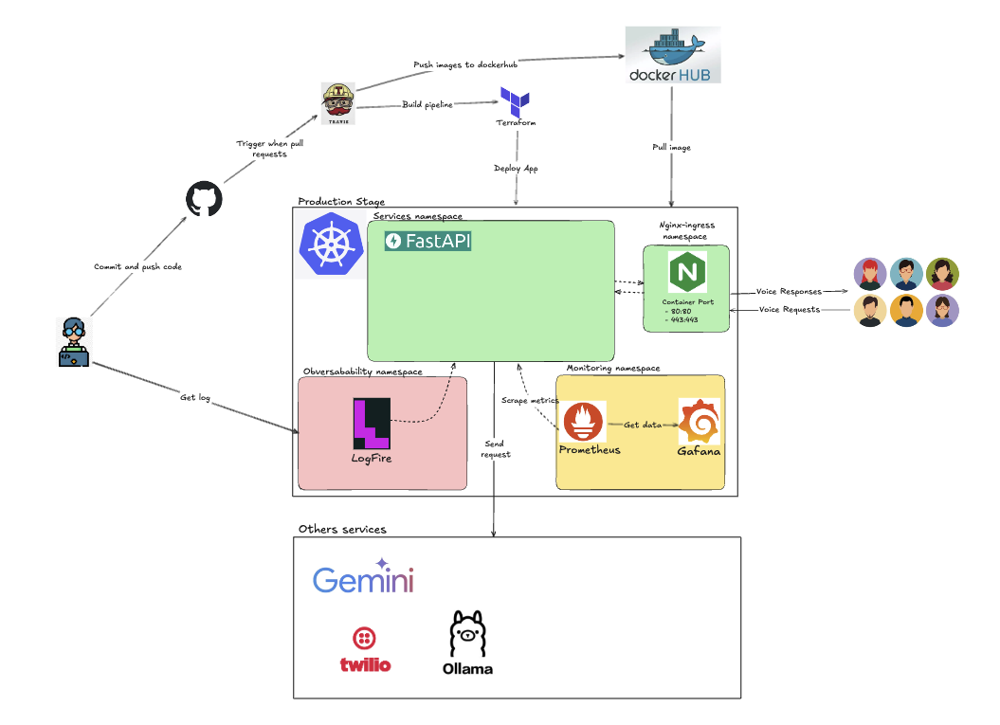

# Real-time-Agentic-MLops

A MLops pipeline for real-time agentic system. Using data from the website (https://www.iqair.com/) to predict the air quality in the city in real-time.

[](./assets/Architecture.png)

## Table of Contents

- [Project Structures](#project-structures)
- [Environments](#environments)
- [Dependencies](#dependencies)
- [Installation](#installation)
- [Usage](#usage)
- [Contributing](#contributing)
- [License](#license)

## Project Structures
```
.
├── agents
├── auth
├── core
├── Dockerfile
├── __init__.py
├── LICENSE
├── Makefile
├── models
├── pyproject.toml
├── README.md
├── routes
├── server.py
├── storage
├── terraform
├── tests
├── tools
├── tracing
├── travis-ci.yml
├── utils
└── values
```


## Environments


